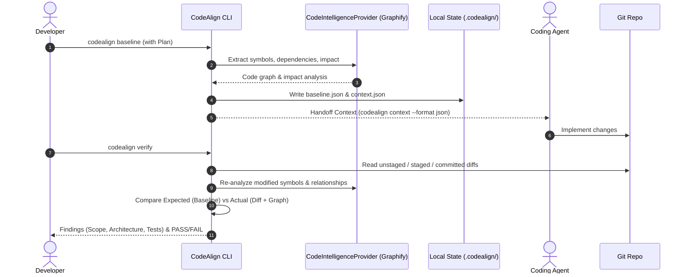

# CodeAlign Architecture

This document describes the architectural design and roadmap for **CodeAlign**.

## Design Philosophy

1. **Deterministic Verification First:** Verification is grounded in code graphs, Git diffs, and developer intent rather than probabilistic or black-box LLM scoring.
2. **Provider Abstraction:** Code intelligence (symbols, calls, dependencies) is isolated behind an abstract provider (`CodeIntelligenceProvider`), starting with Graphify.
3. **Agent Handoff Contract:** The Implementation Baseline acts as both a verification standard and the machine-readable context handed to coding agents.
4. **Local-First & Lightweight:** Local runtime state lives in `.codealign/` without requiring external databases or cloud services.

## Core Modules (Target Architecture)

```text
src/
└── codealign/
    ├── cli.py                     # Typer CLI entrypoint & command dispatch
    ├── commands/                  # Command implementations
    │   ├── init.py
    │   ├── analyze.py
    │   ├── baseline.py
    │   ├── verify.py
    │   ├── status.py
    │   ├── context.py
    │   └── explain.py
    ├── models/                    # Pydantic domain models
    │   ├── plan.py                # Developer intent & implementation plan
    │   ├── baseline.py            # Implementation baseline contract
    │   ├── finding.py             # Verification findings (drift, violations)
    │   └── result.py              # Verification outcome (PASS / WARN / FAIL)
    ├── analysis/                  # Plan parsing & impact analysis
    ├── verification/              # Verification engines (scope, architecture, tests)
    ├── providers/                 # Code intelligence provider interface & implementations
    │   ├── base.py                # CodeIntelligenceProvider protocol / base class
    │   └── graphify.py            # Graphify adapter
    ├── git/                       # Git repository & diff inspection
    └── output/                    # Terminal formatting & JSON serialization
```

## Core Workflow Sequence


